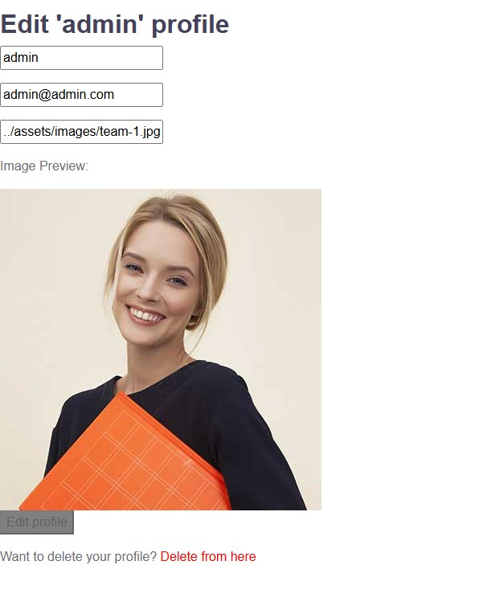

# Artistika

This project was generated with [Angular CLI](https://github.com/angular/angular-cli) version 18.2.11.

## Development server

Run ng serve for a dev server. Navigate to http://localhost:4200/. The application will automatically reload if you change any of the source files.

## Backend server
For a backend, json-server its used, to run it and get all the features for the app, navigate to "assets" folder and run node server.js.

## Code scaffolding

Run `ng generate component component-name` to generate a new component. You can also use `ng generate directive|pipe|service|class|guard|interface|enum|module`.

## Build

Run `ng build` to build the project. The build artifacts will be stored in the `dist/` directory.

## Running unit tests

Run `ng test` to execute the unit tests via [Karma](https://karma-runner.github.io).

## Running end-to-end tests

Run `ng e2e` to execute the end-to-end tests via a platform of your choice. To use this command, you need to first add a package that implements end-to-end testing capabilities.

## Further help

To get more help on the Angular CLI use `ng help` or go check out the [Angular CLI Overview and Command Reference](https://angular.dev/tools/cli) page.

# Artistika Angular Project

This project was generated with [Angular CLI](https://github.com/angular/angular-cli) version 18.2.11.

Credentials for admin account:
username: admin
password: 123456

Credentials for user account:
username: user
password: user123

Home page with list of the available workshops for watching, coming from service, which is taking the information from the json-server and testimonials part which currently is read-only.

About page

 workshops

Add workshop

Workshops list -edit and delete

workshop edit

Edit or remove profile.

Login page, using JWT token for authentication. Token is deleted after logout or an hour inactivity as well. After successful login, automatically redirects you to the Home page.

Register page

Error page , if you navigate to a non-existing path.

